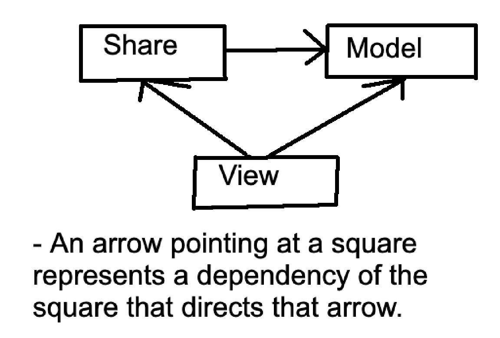
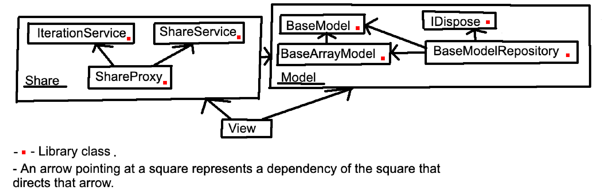

## Install

- [JavaScript/TypeScript](#javascripttypescript)
- [Dart](#dart)

### JavaScript/TypeScript

- package.json

```json
"smv_typescript": "https://github.com/sl8s/smv/releases/download/v2.0.3/smv_typescript_v2_0_3.tgz"
```

### Dart

- pubspec.yaml

```yaml
smv_dart:
  git:
    url: https://github.com/sl8s/smv.git
    ref: v2.0.1
    path: packages/smv_dart
```

## SMV

- SMV (Share, Model, View) - two-layer architectural design pattern. Built based on the three-layer architectural design pattern [library_architecture_mvvm_modify](https://github.com/antonpichka/library_architecture_mvvm_modify). The reason for creating the two-layer architectural design pattern is the high cognitive load associated with the three-layer architectural design pattern. The explanation is provided in the article [Comparison of architectural design patterns](./comparison_of_architectural_design_patterns.pdf) available only in Russian, as my English proficiency is insufficient.

### Abstract Explanation


- Share - exchanges temporary data between views (The data persists only for the lifetime of the application.).
- Model - manages data and provides data.
- View - manages the user interface and displays data to the user.

### Specific Explanation


- Share:
1) IterationService - generates unique strings and stores them to prevent duplication.
2) ShareService - stores data and listeners using a key-value data structure (Map)
3) ShareProxy - stores data and listeners using a key-value structure (Map) and generates a unique string to register listeners based on specific data (e.g., `tokenGoogleUser` (key) -> `listenerId` (key)). This is done to prevent a memory leak when removing a listener via a unique string. Without the unique string, all listeners would be removed. (e.g., `tokenGoogleUser` (key)).
- Model:
1) BaseModel - manages data
2) BaseArrayModel - manages data arrays
3) IDispose - releases database or network connectors from memory.
4) BaseModelRepository - provides data.
- View - manages the user interface and displays data to the user.

#### Example

1) `ModelRepository` (Courier) accesses the network or the database, retrieves the `Model` (Product), and passes the `Model` (Product) to the `View` (User). The `View` (User) interacts with the `Model` (Product), and the `Model` (Product) can change its characteristics.
2) `View` (User) creates a `Model` (Product) and hands it to the `ModelRepository` (Courier) to deliver it to the network or database.
Conclusion: If you remove the `ModelRepository` (Courier), then the task of transferring the `Model` (Product) to the user and to the database or network would fall to the product itself—which is highly illogical.